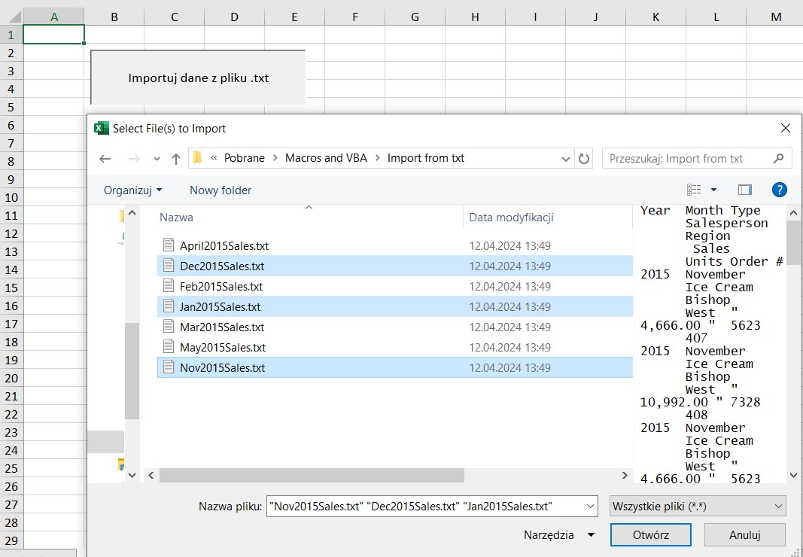

# Portfolio analityczne - Dawid Wolanin: automatyzacja VBA/Excel

Niniejszy projekt ma na celu zaprezentowanie automatyzacji przykładowych zadań w codziennej pracy w środowisku MS Excel przy wykorzystaniu VBA oraz korzystania z narzędzia UserForm.

# Spis treści

- [Importowanie z pliku txt](#importowanie-z-pliku-txt)
- [Automatyzacja raportu](#automatyzacja-raportu)
- [Formularz użytkownika UserForm](#userform)


# Importowanie z pliku txt

## Zarys funkcjonalności

**Cel podprocedury (subprocedure)**: Ta podprocedura importuje dane z jednego lub więcej plików tekstowych do nowych arkuszy w aktywnym skoroszycie Excel.
**Proces:**
- Wybór pliku: Użytkownik jest proszony o wybranie jednego lub więcej plików .txt za pomocą funkcji (GetFiles), która wyświetla okno dialogowe wyboru plików.
- Przetwarzanie plików:
    - Dla każdego wybranego pliku:
    - Plik jest otwierany jako skoroszyt (TextFile).
    - Cały obszar danych z pierwszego arkusza pliku tekstowego jest kopiowany.
    - Do oryginalnego skoroszytu dodawany jest nowy arkusz, a skopiowane dane są do niego wklejane.
    - Nowy arkusz jest przenoszony na określoną pozycję (za wcześniej zaimportowane arkusze) i zmieniana jest jego nazwa na nazwę pliku tekstowego (bez rozszerzenia .txt).
    - Skoroszyt pliku tekstowego jest następnie zamykany bez zapisywania.
    - Aktualizacja ekranu: Aktualizacja ekranu jest wyłączona podczas procesu importu, aby zwiększyć wydajność i uniknąć migotania. Zostaje włączona po zakończeniu.

**Stworzenie funkcji (GetFiles)**:
**Cel**: Ta funkcja wyświetla okno dialogowe, w którym użytkownik może wybrać jeden lub więcej plików tekstowych do importu.
Wynik: Funkcja zwraca tablicę ścieżek plików wybranych przez użytkownika. Jeśli użytkownik anuluje wybór, funkcja zwraca wartość False.


```vba
Public Sub ImportTextFile()
    ' Ta podprocedura importuje jeden lub więcej plików .txt do nowych arkuszy w bieżącym skoroszycie Excel.
    
    ' Deklarowanie zmiennych
    Dim TextFile As Workbook         ' Zmienna do przechowywania obiektu skoroszytu dla otwieranego pliku tekstowego
    Dim OpenFiles() As Variant       ' Tablica do przechowywania ścieżek wybranych plików tekstowych
    Dim i As Integer                 ' Licznik pętli do iterowania po wybranych plikach
    
    ' Wywołaj funkcję GetFiles, aby wyświetlić okno dialogowe wyboru pliku i zachować ścieżki wybranych plików
    OpenFiles = GetFiles()
    
    ' Wyłącz aktualizację ekranu, aby poprawić wydajność i uniknąć migotania podczas procesu
    Application.ScreenUpdating = False
    
    ' Pętla po każdym wybranym pliku, importowanie jego zawartości do nowego arkusza
    For i = 1 To Application.CountA(OpenFiles)
        
        ' Otwórz plik tekstowy jako nowy skoroszyt i przypisz do niego zmienną TextFile
        Set TextFile = Workbooks.Open(OpenFiles(i))
        
        ' Kopiuj cały region danych z pierwszego arkusza pliku tekstowego (zakładając, że wszystko znajduje się w jednym regionie)
        TextFile.Sheets(1).Range("A1").CurrentRegion.Copy
        
        ' Aktywuj pierwotny skoroszyt (ten, który był otwarty przed importem plików tekstowych)
        Workbooks(1).Activate
        
        ' Dodaj nowy arkusz do oryginalnego skoroszytu
        Workbooks(1).Worksheets.Add
        
        ' Wklej skopiowane dane do nowo dodanego arkusza
        ActiveSheet.Paste
        
        ' Przenieś nowy arkusz do właściwej pozycji w skoroszycie
        ' Jest umieszczany za arkuszem o indeksie (i + 1), utrzymując kolejność importowanych plików
        
        ' Zmień nazwę nowego arkusza tak, aby odpowiadała nazwie oryginalnego pliku tekstowego, usuwając rozszerzenie ".txt"
        ActiveSheet.Name = Replace(TextFile.Name, ".txt", "")
        
        ' Wyjdź z trybu wycinania/kopiowania, aby wyczyścić schowek i uniknąć problemów z kolejnymi operacjami
        Application.CutCopyMode = False
        
        ' Zamknij skoroszyt pliku tekstowego bez zapisywania zmian (został otwarty tylko do kopiowania danych)
        TextFile.Close
    Next i
    
    ' Włącz ponownie aktualizację ekranu po zakończeniu procesu importu
    Application.ScreenUpdating = True
End Sub

Public Function GetFiles() As Variant
    ' Ta funkcja wyświetla okno dialogowe, które umożliwia użytkownikowi wybranie jednego lub więcej plików .txt do importu.
    ' Zwraca tablicę ścieżek wybranych plików.
    
    GetFiles = Application.GetOpenFilename(Title:="Select File(s) to Import", MultiSelect:=True)
End Function
```

Proces importowania plików *.txt wybranych z okna dialogowego jest inicjowany przy naciśnięciu przycisku z przypisanym odpowiednim makrem:




# Automatyzacja raportu

## Zarys funkcjonalności

**Cel kodu**

Ten skrypt może być używany do konsolidowania i formatowania danych z wielu arkuszy w jeden raport roczny.

- LoopYearlyReport: Iteruje przez wszystkie arkusze, z wyłączeniem arkusza z raportem rocznym "YEARLY REPORT". Dla każdego arkusza sprawdza, czy zawiera dane, wstawia i formatuje nagłówki, automatyzuje sumowanie w określonej kolumnie, a następnie kopiuje dane do arkusza "YEARLY REPORT".
- AutomateTotalSUM: Dodaje formułę sumy do kolumny "F" w każdym arkuszu, sumując wszystkie wartości od wiersza 2 do ostatniego wiersza z danymi.
- InsertHeaders: Wstawia nowy wiersz na początku arkusza i wypełnia go zdefiniowanymi nagłówkami.
- FormatHeaders: Formatuje wiersz nagłówka, aby był wizualnie wyróżniony, oraz stosuje formatowanie walutowe do danych, zapewniając, że kolumny są dopasowane do rozmiaru zawartości.

```vba
Sub LoopYearlyReport()
    ' Deklarowanie zmiennych
    Dim ws As Worksheet            ' Zmienna do przechowywania każdego arkusza w skoroszycie
    Dim firstTime As Boolean       ' Wskaźnik sprawdzający, czy dane są wklejane po raz pierwszy do raportu rocznego
    
    ' Inicjalizacja firstTime jako True, co oznacza, że żadne dane jeszcze nie zostały wklejone
    firstTime = True
    
    ' Pętla przez każdy arkusz w skoroszycie
    For Each ws In Worksheets
        ' Wybierz bieżący arkusz według jego nazwy
        Worksheets(ws.Name).Select
        
        ' Sprawdź, czy nazwą arkusza nie jest "YEARLY REPORT" oraz czy komórka A1 nie jest pusta
        If ws.Name <> "YEARLY REPORT" And ActiveSheet.Range("A1").Value <> "" Then
            ' Wywołaj podprocedury w celu wstawienia nagłówków, sformatowania nagłówków i automatycznego obliczenia sum
            InsertHeaders
            FormatHeaders
            AutomateTotalSUM
            
            ' Zaznacz zakres danych zaczynający się od A2 i rozciągający się do ostatniego wiersza i ostatniej kolumny danych
            Range("A2").Select
            Range(Selection, Selection.End(xlDown)).Select
            Range(Selection, Selection.End(xlToRight)).Select
            
            ' Kopiuj zaznaczone dane
            Selection.Copy
            
            ' Przełącz na arkusz "YEARLY REPORT"
            Worksheets("YEARLY REPORT").Select
            
            ' Przejdź do ostatniego wiersza z danymi w kolumnie A, a następnie przejdź o jeden wiersz w dół, aby znaleźć kolejny pusty wiersz
            Range("A30000").Select   ' Celowo duża liczba wiersza, aby upewnić się, że kursor przesunął się do ostatniego wiersza z danymi
            Selection.End(xlUp).Select
            
            ' Jeśli to nie jest pierwszy raz, przesuń się o jeden wiersz w dół przed wklejeniem
            If firstTime <> True Then
                ActiveCell.Offset(1, 0).Select
            Else
                ' Jeśli to pierwszy raz, ustaw firstTime na False dla kolejnych iteracji
                firstTime = False
            End If
            
            ' Wklej skopiowane dane do arkusza "YEARLY REPORT"
            ActiveSheet.Paste
        End If
    ' Przejdź do następnego arkusza w pętli
    Next ws
    
    ' Ponownie wybierz arkusz "YEARLY REPORT", aby wykonać ostateczne operacje
    Worksheets("Yearly Report").Select
    
    ' Ponownie wstaw nagłówki, sformatuj je i zautomatyzuj obliczenie sum dla raportu końcowego
    InsertHeaders
    FormatHeaders
    AutomateTotalSUM
    
End Sub

Public Sub AutomateTotalSUM()
    ' Deklarowanie zmiennych
    Dim lastCell As String   ' Zmienna do przechowywania adresu ostatniej komórki w kolumnie z danymi
    
    ' Select cell F2 (zakładając, że sumy znajdują się w kolumnie F)
    Range("F2").Select
    
    ' Przejdź do ostatniej komórki w kolumnie z danymi
    Selection.End(xlDown).Select
    
    ' Przechowaj adres ostatniej komórki z danymi w zmiennej lastCell
    lastCell = ActiveCell.Address(False, False)
    
    ' Przesuń się o jedną komórkę w dół, aby umieścić formułę sumy poniżej danych
    ActiveCell.Offset(1, 0).Select
    
    ' Wprowadź formułę SUMA w wybranej komórce, sumując zakres od F2 do ostatniej komórki z danymi
    ActiveCell.Value = "=SUM(F2:" & lastCell & ")"
End Sub

Sub InsertHeaders()
`
' Makro InsertHeaders - kod uzyskany częściowo przez funkcję "Zarejestruj makro"
' Wstawia nowy wiersz na górze arkusza i dodaje nagłówki dla kolumn danych
`

    ' Wstaw nowy wiersz na górze arkusza
    Rows("1:1").Select
    Selection.Insert Shift:=xlDown
    
    ' Dodaj nagłówki do nowo wstawionego wiersza
    Range("A1").Select
    ActiveCell.FormulaR1C1 = "Division"   ' Column A header
    Range("B1").Select
    ActiveCell.FormulaR1C1 = "Category"   ' Column B header
    Range("C1").Select
    ActiveCell.FormulaR1C1 = "Jan"        ' Column C header
    Range("D1").Select
    ActiveCell.FormulaR1C1 = "Feb"        ' Column D header
    Range("E1").Select
    ActiveCell.FormulaR1C1 = "Mar"        ' Column E header
    Range("F1").Select
    ActiveCell.FormulaR1C1 = "Total"      ' Column F header
    
    ' Przenieś kursor do komórki A2, aby przygotować arkusz do wprowadzania danych
    Range("A2").Select
End Sub

Sub FormatHeaders()
'
' Makro FormatHeaders - kod uzyskany częściowo przez funkcję "Zarejestruj makro"
' Formatuje nagłówki i dane, aby poprawić czytelność i prezentację
'

    ' Wybierz wiersz nagłówka (A1:F1) w celu zastosowania formatowania
    Range("A1:F1").Select
    Selection.Font.Bold = True     ' Ustawienie czcionki nagłówków na pogrubioną
    With Selection.Interior
        .Pattern = xlSolid
        .PatternColorIndex = xlAutomatic
        .ThemeColor = xlThemeColorAccent1   ' Ustawienie koloru tła nagłówków
        .TintAndShade = 0
        .PatternTintAndShade = 0
    End With
    With Selection.Font
        .ThemeColor = xlThemeColorDark1     ' Ustawienie koloru czcionki dla nagłówków
        .TintAndShade = 0
    End With
    
    ' Zastosuj dolne obramowanie do nagłówków
    Selection.Borders(xlDiagonalDown).LineStyle = xlNone
    Selection.Borders(xlDiagonalUp).LineStyle = xlNone
    Selection.Borders(xlEdgeLeft).LineStyle = xlNone
    Selection.Borders(xlEdgeTop).LineStyle = xlNone
    With Selection.Borders(xlEdgeBottom)
        .LineStyle = xlContinuous
        .ColorIndex = 0
        .TintAndShade = 0
        .Weight = xlMedium
    End With
    Selection.Borders(xlEdgeRight).LineStyle = xlNone
    Selection.Borders(xlInsideVertical).LineStyle = xlNone
    Selection.Borders(xlInsideHorizontal).LineStyle = xlNone
    
    ' Ustaw rozmiar czcionki dla nagłówków
    Selection.Font.Size = 12
    
    ' Wybierz zakres danych zaczynający się od C2 i rozciągający się do ostatniego wiersza i kolumny, a następnie zastosuj format walutowy
    Range("C2").Select
    Range(Selection, Selection.End(xlDown)).Select
    Range(Selection, Selection.End(xlToRight)).Select
    Selection.Style = "Currency"
    
    ' Automatycznie dopasuj szerokość kolumn B do F do rozmiaru zawartości
    Columns("B:F").Select
    Columns("B:F").EntireColumn.AutoFit
    
    ' Przenieś kursor z powrotem do komórki A2
    Range("A2").Select
End Sub


```


